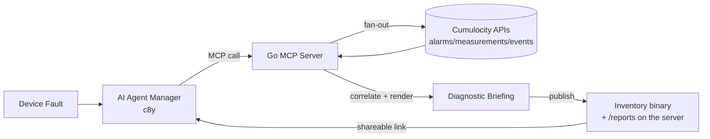

# Automated Root Cause & Diagnostics Report MCP Server

**Challenge**: AI Tools

### Description

Troubleshoot intermittent device issues, root cause analysis requires combining multiple data sources — recent alarm logs, high-frequency measurement spikes, firmware change history, and active threshold rules. Build a custom Model Context Protocol (MCP) server that acts as a diagnostic engine. When called by a Cumulocity AI agent, the MCP server collects telemetry history around a fault timestamp, correlates anomalies across neighbor assets, and outputs a structured HTML/Markdown Diagnostic Briefing document saved to Cumulocity Application Hosting.

### Expected Outcome

An MCP server microservice running via SSE that exposes an analyze_device_failure_2 tool to the AI Agent Manager.
Automated artifact generation containing diagnostic charts, evidence summaries, and recommended field technician steps.
Demonstration of an agent using the tool to generate a shareable report link directly within chat.

### Needed Skills

MCP Server development (Node.js/NestJS or Python)
Cumulocity REST APIs
HTML/Markdown reporting

## Architectural Layout



## Device Simulator

The fleet is a set of six *Power Node* controllers — model SIM-PN-100, firmware
`powernode-fw` 1.4.2 — mounted in low-voltage distribution cabinets of a
utility. Each one is a smart feeder monitor: it measures the phase voltage it
sits on (`sim_Voltage.U`, nominal 230 V), the current its downstream load draws
(`sim_Current.I`, ~12 A with a residential day/evening curve), and its own
cabinet temperature (`sim_Temperature.T`, ~38 °C). It reports every minute,
holds local threshold rules (under-voltage below 207 V, over-temperature above
52 °C), and raises alarms itself when those trip. It also has a brown-out
detector that force-restarts the controller when the supply collapses too far —
which is why a reset leaves a ~75 s hole in its telemetry.

Four of them (`sim-node-01`…`04`) hang off **Feeder-A** at *SIM Substation
Alpha*, ordered by electrical distance from the substation: node 01 is at the
weak end of the line and feels every disturbance fully, the others
progressively less. Two more (`sim-node-05`, `06`) sit on **Feeder-B** at *SIM
Substation Beta*, a healthy feeder, and exist purely as a control group.

The story the data tells: Feeder-A is overloaded. Over the past week it has
sagged five times — a first dip nobody noticed five days ago, then longer and
deeper ones, ending in an 18-minute brownout at the fault timestamp. During
each sag the nodes' constant-power loads pull *more* current at lower voltage,
the cabinets heat up, and the weakest node reboots. A field technician sees
only "node 01 keeps dropping out", and a firmware update six days earlier looks
like an obvious suspect — but the update predates the first dip and the healthy
Feeder-B nodes on the same firmware are fine, while all Feeder-A nodes sag at
the same second. The root cause is the feeder, not the device, and that is
exactly the inference the MCP diagnostic engine has to make.

`simulator/` seeds a tenant with exactly this scenario.

```
export C8Y_BASEURL=https://mytenant.eu-latest.cumulocity.com
export C8Y_TENANT=t12345 C8Y_USER=me C8Y_PASSWORD=...

cd simulator
go run . -dry-run                 # print the scenario, no API calls
go run . -mode backfill           # seed 7d of backdated history, then exit
go run . -mode both               # seed, then stream live over MQTT
```

Useful flags: `-fault -3h|<RFC3339>`, `-history 7d`, `-interval 1m`,
`-hf-interval 5s`, `-neighbors 3`, `-baseline 2`, `-transport mqtt|rest`,
`-brownout-every 15m`.

### Starting over

Seeding twice stacks a second copy of the history on top of the first, which
ruins the baselines the diagnostic engine computes. `-purge` removes the
fleet's measurements, alarms and events and then exits. Devices, groups,
inventory fragments and external IDs survive on purpose: the next backfill
reuses the same managed objects, so device IDs in reports and dashboards keep
resolving.

```
go run . -purge -dry-run          # count what would be deleted
go run . -purge                   # delete it, keeping the devices
go run . -mode backfill -fault -2h
```

Stop any running live simulator first, otherwise it refills the tenant behind
the purge. Two platform details are worth knowing, both handled by the tool:
`DELETE /measurement/measurements` rejects a date range that is not truncated
to the hour, and it deletes asynchronously, so a single pass leaves a residue
of a few dozen records. `-purge` widens the range to whole hours and repeats
delete-and-verify until the counts stop dropping. If it still warns that data
remains, something is publishing.

### Running the simulator in the tenant

The simulator is also packaged as a microservice, so a demo tenant keeps
producing data without anybody's laptop being online:

```
cd simulator
nix shell nixpkgs#zip nixpkgs#cacert --command ./package-microservice.sh
./deploy-microservice.sh
curl -u "$C8Y_TENANT/$C8Y_USER:$C8Y_PASSWORD" \
  "$C8Y_BASEURL/service/brownout-simulator-2/health"
```

It needs no credentials of its own. Cumulocity injects `C8Y_BASEURL`,
`C8Y_TENANT`, `C8Y_USER` and `C8Y_PASSWORD` for the subscribed tenant's
service user, which is exactly what the flags already read from the
environment; the manifest asks for the `*_ADMIN` roles on inventory, identity,
measurements, alarms and events, because the simulator writes rather than
reads.

Three things had to change for the platform, and they explain the image
defaults (`SIM_LISTEN=:80`, `SIM_MODE=both`, `SIM_TRANSPORT=rest`,
`SIM_FAULT=-2h`):

- **A health endpoint.** The platform restarts a container whose `/health`
  does not answer, so the simulator serves one and reports its phase
  (`starting`, `backfilling`, `live`, `idle`). It binds the socket before
  seeding starts, because a week of backfill takes longer than the readiness
  probe is willing to wait.
- **REST instead of MQTT.** In the cluster the base URL is an internal address
  with no broker behind it, and MQTT would need device credentials from a bulk
  registration that cannot be handed to a running container. `-transport auto`
  therefore detects the microservice and switches to REST.
- **An idempotent backfill.** A container restarts on every rollout, and
  seeding again would lay a second copy of the history on top of the first,
  doubling the sample density and skewing the pre-fault baselines the
  diagnostic engine derives from it. The backfill now counts the measurements
  each device already holds in the target window and skips the ones that are
  populated. `-force-backfill` overrides that, `-purge` is the honest way to
  start over.

### Bulk device registration (optional)

The simulator provisions the devices over the Inventory API by itself. If you
prefer registering them in the tenant first, generate a *full* bulk
registration CSV (`;`-separated, as expected by Devices → Registration →
Register device → Bulk registration → General):

```
go run . -registration-csv devices.csv -device-password 'S1mN0de!Hack26'
```

| ID | CREDENTIALS | TYPE | NAME | IDTYPE | PATH | SHELL | AUTH_TYPE |
| --- | --- | --- | --- | --- | --- | --- | --- |
| `sim-node-01` … `sim-node-06` | device password | `sim_PowerNode` | `Power Node NN (Feeder-X)` | `c8y_Serial` | `SIM Substation Alpha`/`Beta` | 0 | BASIC |

Cumulocity turns each row into the device user `<tenant>/device_<ID>` with the
CSV password and creates the group from `PATH`. Pass the same password to the
simulator (`-device-password`, env `C8Y_DEVICE_PASSWORD`) so the live MQTT
phase connects as the device instead of as the tenant user. `devices.csv` is
gitignored because it contains credentials; regenerate it anytime.

Note: for devices that already exist, Cumulocity only applies the group
assignment and new external IDs from the CSV — the inventory fragments the
diagnostic engine needs are always written by the simulator's provisioning
step.
Fleet (idempotent, keyed by `c8y_Serial`): `sim-node-01` is the reported
failing device (coupling 1.0), `02`–`04` are neighbours on `Feeder-A` in group
*SIM Substation Alpha* with decreasing coupling, `05`–`06` are healthy nodes on
`Feeder-B` in *SIM Substation Beta*.

### Data contract for the MCP server

| Kind | Name | Notes |
| --- | --- | --- |
| Device type | `sim_PowerNode` | fragments `sim_Topology` (site/feeder/role/coupling), `sim_Thresholds` (active threshold rules), `c8y_Firmware` |
| Measurement | `sim_Voltage.U` (V), `sim_Current.I` (A), `sim_Temperature.T` (C) | type `sim_PowerNodeTelemetry`, 1 min base grid, 5 s around episodes |
| Alarm | `sim_UnderVoltage` (<207 V), `sim_OverTemperature` (>52 C) | historical ones CLEARED, the fault episode stays ACTIVE; `sim_Evidence` fragment carries min voltage + threshold |
| Event | `sim_SupplyDip`, `sim_BrownoutReset`, `sim_FirmwareUpdated` | dip events carry `sim_SupplyDip.minVoltageV`/`durationS`; firmware change is a deliberate red herring (predates the first dip) |

Episodes are intermittent and escalating (≈ -5d, -2d, -26h, -3h, fault) and
telemetry has a 75 s gap after each brownout reset, so correlation across
neighbours — not the firmware change — is the only consistent root cause.

## MCP Server

`mcp/` is the diagnostic server. It exposes a single tool,
`analyze_device_failure_2`, over SSE, and it never writes to the tenant apart from
storing the briefing it produces.

```
export C8Y_BASEURL=https://mytenant.eu-latest.cumulocity.com
export C8Y_TENANT=t12345 C8Y_USER=me C8Y_PASSWORD=...

cd mcp
go run . -public-url https://mcp.example.com   # serve /sse, /reports/, /health
go run . -analyze sim-node-01 -fault -3h -out briefing.html   # no MCP client needed
```

Useful flags: `-addr :8080`, `-reports-dir ./reports` (persist briefings across
restarts), `-before 2h`, `-after 30m`, `-max-neighbors 6`, `-smart-rules` (also
query the smart rule service for thresholds), `-v`.

### The tool

`analyze_device_failure_2` takes `device` (managed object ID, `c8y_Serial`, or
name) and optionally `faultTime`, `symptom`, `beforeMinutes`, `afterMinutes`,
`includeNeighbors`, `maxNeighbors`, `lookbackDays`. It returns a structured
verdict for the agent plus a link to a rendered HTML briefing for the field
team.

### How it reaches a verdict

1. **Resolve & fan out.** The device is looked up by ID, external ID or name,
   its parent groups give the neighbouring assets, and all of them are
   collected in parallel: measurements, alarms, events, firmware history, and
   whatever threshold rules the inventory fragments (or smart rules) declare.
2. **Detect.** Per series, a baseline is taken from the pre-fault window using
   the median and MAD, so the sag itself cannot drag the baseline down. Two
   kinds of anomaly come out of that: a *threshold breach* against a configured
   limit, and a *deviation* of at least 6 sigma with a meaningful relative
   change. Holes in the telemetry are found against the observed sample rate.
3. **Correlate.** The strongest anomaly on the target is looked for on every
   neighbour, and only counts as correlated if the onset is simultaneous. A
   rule-backed breach outranks a statistical deviation here on purpose: at a
   constant-power load the current rise is the *consequence* of the voltage sag,
   and correlating on the consequence would point at the wrong quantity.
4. **Conclude.** Neighbours on the same feeder sagging at the same second means
   shared infrastructure; an anomaly nobody else sees means the device. The
   firmware update is explicitly ruled out when it predates the first symptom or
   also runs on unaffected assets, and the recommendations follow the scope —
   inspect the supply rather than swap the node.

The ratio in step 4 counts only the neighbours that actually report the series
in question. Real asset groups are mixed, and a door sensor that has no opinion
on voltage is not evidence that the voltage is fine: counting it as unaffected
would dilute a genuine feeder-wide fault below the threshold and send someone to
replace a healthy node. Assets that cannot speak to the series are reported
separately and excluded from the ratio, and if *none* of the neighbours carries
it, the verdict says so and drops to low confidence rather than claiming the
fault is isolated.

### The briefing

The report is a standalone HTML document: inline SVG charts per series with the
threshold lines and the fault marker drawn in, the evidence tables, and the
verdict. No scripts and no external resources, so it renders from a file, an
email attachment or a link. A Markdown rendering of the same briefing is
available for chat clients.

It is published twice: as an inventory binary in the tenant (tagged
`c8y_DiagnosticBriefing`, so it stays with the device history) and under
`/reports/<id>.html` on this service, which is the link handed to the agent.
`-public-url` decides what that link looks like; deployed as a microservice it
is derived automatically.

### Deploying as a Cumulocity microservice

```
cd mcp
./package-microservice.sh                      # -> diagnostic-agent-2-<version>.zip
./deploy-microservice.sh                       # upload + subscribe (uses C8Y_* env)
```

No Docker daemon is involved. The server is a static Go binary, so the image is
a single layer holding the binary and a CA bundle, and `package-microservice.sh`
writes the `docker save` tarball directly with `tar`. The build is deterministic
and the result is a normal image that `docker load` or `skopeo` accepts. If you
do have Docker, the equivalent `Dockerfile` is there too.

`cumulocity.json` declares `PER_TENANT` isolation. That matters: the platform
then injects `C8Y_TENANT`, `C8Y_USER` and `C8Y_PASSWORD` of the per-tenant
service user, which are exactly the variables the server already reads, so no
credential handling is needed for the deployed case. The required permissions
are inventory read/admin (admin only to store the briefing), identity read and
measurement, alarm and event read.

Three things the platform imposes that the code has to account for:

- **Port 80 only.** Set through `MCP_ADDR` in the image.
- **The mount point is stripped.** Requests arrive at `/sse`, not
  `/service/diagnostic-agent-2/sse`, but the SSE transport has to advertise its
  POST endpoint *with* the prefix or the client posts to the tenant root. The
  server restores it from `X-Forwarded-Prefix`, falling back to the configured
  service name.
- **`C8Y_BASEURL` is cluster-internal** (`http://cumulocity:8111`). Usable for
  API calls, useless in a link, so the public domain is read once from
  `/tenant/currentTenant` and used for everything a human opens.

There are no volumes, so briefings live in memory plus the inventory binary;
`-reports-dir` is for local runs only. Note also that the platform caps request
lifetime at 15 minutes, which bounds how long a single SSE stream survives.

### Registering with the AI Agent Manager

The deployed microservice is just an endpoint until the `ai` application knows
about it. Its registry lives behind `/service/ai/mcp/servers`:

```sh
./register-mcp-server.sh          # POST the registration, then list the tools
./register-mcp-server.sh --test   # dry run: connect and enumerate tools only
```

`--test` hits `/service/ai/mcp/servers/test`, which opens the SSE stream,
performs the MCP handshake and returns the discovered tool list without storing
anything. It is the fastest way to tell a broken deployment from a broken
registration.

The registration itself is a small document: `name`, `description`, the public
`/sse` URL, `type: sse` and `sendAuthentication: true`. The last flag makes the
agent forward the calling user's credentials, so the diagnosis runs with that
user's permissions rather than the service user's. Once stored, the tool shows
up in the agent builder alongside the built-in `cumulocity-default` tools.

Registering the server only makes the tool *available*; it does not attach it to
anything. Each agent carries its own `mcp` array naming the servers and tools it
may use, so the last step is wiring one up:

```sh
curl -u "$C8Y_TENANT/$C8Y_USER:$C8Y_PASSWORD" -X POST \
  -H 'Content-Type: application/json' \
  -d '{"name":"device-diagnostics-2","type":"text","availability":"SHARED",
       "mcp":[{"serverName":"diagnostic-agent",
               "tools":["analyze_device_failure_2"]}],
       "agent":{"system":"You are a field-service diagnostics assistant ..."}}' \
  "$C8Y_BASEURL/service/ai/agent/text"
```

A `text` agent is the right shape here: an `object` agent forces every answer
through a fixed JSON schema, which buys nothing when the useful output is prose
plus a link. The system prompt does the real work — it has to insist the tool is
called before any answer is given, explain how to resolve vague reports
("this morning") into an RFC3339 `faultTime`, and require that the briefing link
is passed through verbatim. Note that `temperature` is rejected outright by the
configured model, despite being documented in the agent schema.
