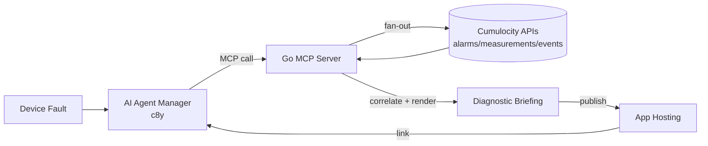

# Automated Root Cause & Diagnostics Report MCP Server

**Challenge**: AI Tools

### Description

Troubleshoot intermittent device issues, root cause analysis requires combining multiple data sources — recent alarm logs, high-frequency measurement spikes, firmware change history, and active threshold rules. Build a custom Model Context Protocol (MCP) server that acts as a diagnostic engine. When called by a Cumulocity AI agent, the MCP server collects telemetry history around a fault timestamp, correlates anomalies across neighbor assets, and outputs a structured HTML/Markdown Diagnostic Briefing document saved to Cumulocity Application Hosting.

### Expected Outcome

An MCP server microservice running via SSE that exposes an analyze_device_failure tool to the AI Agent Manager.
Automated artifact generation containing diagnostic charts, evidence summaries, and recommended field technician steps.
Demonstration of an agent using the tool to generate a shareable report link directly within chat.

### Needed Skills

MCP Server development (Node.js/NestJS or Python)
Cumulocity REST APIs
HTML/Markdown reporting

## Architectural Layout



## Device Simulator

The fleet is a set of six *Power Node* controllers — model SIM-PN-100, firmware
`powernode-fw` 1.4.2 — mounted in low-voltage distribution cabinets of a
utility. Each one is a smart feeder monitor: it measures the phase voltage it
sits on (`sim_Voltage.U`, nominal 230 V), the current its downstream load draws
(`sim_Current.I`, ~12 A with a residential day/evening curve), and its own
cabinet temperature (`sim_Temperature.T`, ~38 °C). It reports every minute,
holds local threshold rules (under-voltage below 207 V, over-temperature above
52 °C), and raises alarms itself when those trip. It also has a brown-out
detector that force-restarts the controller when the supply collapses too far —
which is why a reset leaves a ~75 s hole in its telemetry.

Four of them (`sim-node-01`…`04`) hang off **Feeder-A** at *SIM Substation
Alpha*, ordered by electrical distance from the substation: node 01 is at the
weak end of the line and feels every disturbance fully, the others
progressively less. Two more (`sim-node-05`, `06`) sit on **Feeder-B** at *SIM
Substation Beta*, a healthy feeder, and exist purely as a control group.

The story the data tells: Feeder-A is overloaded. Over the past week it has
sagged five times — a first dip nobody noticed five days ago, then longer and
deeper ones, ending in an 18-minute brownout at the fault timestamp. During
each sag the nodes' constant-power loads pull *more* current at lower voltage,
the cabinets heat up, and the weakest node reboots. A field technician sees
only "node 01 keeps dropping out", and a firmware update six days earlier looks
like an obvious suspect — but the update predates the first dip and the healthy
Feeder-B nodes on the same firmware are fine, while all Feeder-A nodes sag at
the same second. The root cause is the feeder, not the device, and that is
exactly the inference the MCP diagnostic engine has to make.

`simulator/` seeds a tenant with exactly this scenario.

```
export C8Y_BASEURL=https://mytenant.eu-latest.cumulocity.com
export C8Y_TENANT=t12345 C8Y_USER=me C8Y_PASSWORD=...

cd simulator
go run . -dry-run                 # print the scenario, no API calls
go run . -mode backfill           # seed 7d of backdated history, then exit
go run . -mode both               # seed, then stream live over MQTT
```

Useful flags: `-fault -3h|<RFC3339>`, `-history 7d`, `-interval 1m`,
`-hf-interval 5s`, `-neighbors 3`, `-baseline 2`, `-transport mqtt|rest`,
`-brownout-every 15m`.

### Bulk device registration (optional)

The simulator provisions the devices over the Inventory API by itself. If you
prefer registering them in the tenant first, generate a *full* bulk
registration CSV (`;`-separated, as expected by Devices → Registration →
Register device → Bulk registration → General):

```
go run . -registration-csv devices.csv -device-password 'S1mN0de!Hack26'
```

| ID | CREDENTIALS | TYPE | NAME | IDTYPE | PATH | SHELL | AUTH_TYPE |
| --- | --- | --- | --- | --- | --- | --- | --- |
| `sim-node-01` … `sim-node-06` | device password | `sim_PowerNode` | `Power Node NN (Feeder-X)` | `c8y_Serial` | `SIM Substation Alpha`/`Beta` | 0 | BASIC |

Cumulocity turns each row into the device user `<tenant>/device_<ID>` with the
CSV password and creates the group from `PATH`. Pass the same password to the
simulator (`-device-password`, env `C8Y_DEVICE_PASSWORD`) so the live MQTT
phase connects as the device instead of as the tenant user. `devices.csv` is
gitignored because it contains credentials; regenerate it anytime.

Note: for devices that already exist, Cumulocity only applies the group
assignment and new external IDs from the CSV — the inventory fragments the
diagnostic engine needs are always written by the simulator's provisioning
step.
Fleet (idempotent, keyed by `c8y_Serial`): `sim-node-01` is the reported
failing device (coupling 1.0), `02`–`04` are neighbours on `Feeder-A` in group
*SIM Substation Alpha* with decreasing coupling, `05`–`06` are healthy nodes on
`Feeder-B` in *SIM Substation Beta*.

### Data contract for the MCP server

| Kind | Name | Notes |
| --- | --- | --- |
| Device type | `sim_PowerNode` | fragments `sim_Topology` (site/feeder/role/coupling), `sim_Thresholds` (active threshold rules), `c8y_Firmware` |
| Measurement | `sim_Voltage.U` (V), `sim_Current.I` (A), `sim_Temperature.T` (C) | type `sim_PowerNodeTelemetry`, 1 min base grid, 5 s around episodes |
| Alarm | `sim_UnderVoltage` (<207 V), `sim_OverTemperature` (>52 C) | historical ones CLEARED, the fault episode stays ACTIVE; `sim_Evidence` fragment carries min voltage + threshold |
| Event | `sim_SupplyDip`, `sim_BrownoutReset`, `sim_FirmwareUpdated` | dip events carry `sim_SupplyDip.minVoltageV`/`durationS`; firmware change is a deliberate red herring (predates the first dip) |

Episodes are intermittent and escalating (≈ -5d, -2d, -26h, -3h, fault) and
telemetry has a 75 s gap after each brownout reset, so correlation across
neighbours — not the firmware change — is the only consistent root cause.
