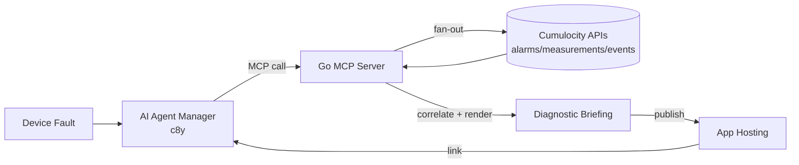

# Automated Root Cause & Diagnostics Report MCP Server

**Challenge**: AI Tools

### Description

Troubleshoot intermittent device issues, root cause analysis requires combining multiple data sources — recent alarm logs, high-frequency measurement spikes, firmware change history, and active threshold rules. Build a custom Model Context Protocol (MCP) server that acts as a diagnostic engine. When called by a Cumulocity AI agent, the MCP server collects telemetry history around a fault timestamp, correlates anomalies across neighbor assets, and outputs a structured HTML/Markdown Diagnostic Briefing document saved to Cumulocity Application Hosting.

### Expected Outcome

An MCP server microservice running via SSE that exposes an analyze_device_failure tool to the AI Agent Manager.
Automated artifact generation containing diagnostic charts, evidence summaries, and recommended field technician steps.
Demonstration of an agent using the tool to generate a shareable report link directly within chat.

### Needed Skills

MCP Server development (Node.js/NestJS or Python)
Cumulocity REST APIs
HTML/Markdown reporting

## Architectural Layout

