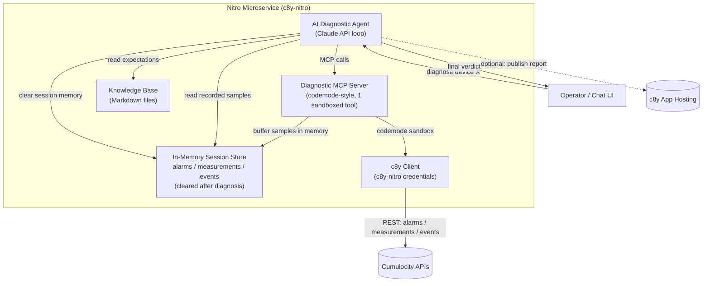

# Functional Description — AI Diagnostic Agent & Diagnostic MCP Server

**Project:** Automated Root Cause & Diagnostics for Cumulocity IoT
**Challenge:** AI Tools
**Status:** Draft for review
**Date:** 2026-09-21

---

## 1. Purpose

Build a self-contained **Nitro microservice** for the Cumulocity IoT platform that hosts an **AI diagnostic agent**. The agent identifies *faulty devices* and pinpoints the *root cause category* of the fault — whether the problem manifests as a bad **measurement**, an **alarm**, or an **event**.

The agent works in two sampling passes:

1. **First pass — Record.** Pull the device's telemetry (alarms, measurements, events) from Cumulocity via a purpose-built **diagnostic MCP server** and buffer it in a temporary **in-memory store** (cleared after the diagnosis).
2. **Analyze.** Compare the recorded data against a **Markdown knowledge base** that describes the expected behaviour for that device type.
3. **Second pass — Re-sample & Confirm.** Record a second window of telemetry, compare against the first pass and the expectations, and rule out transient noise.
4. **Conclude.** Emit a final structured verdict: *what is wrong* and *which signal domain (measurement / alarm / event) the fault lives in*, with supporting evidence.

The entire reasoning loop, the MCP tools, the in-memory session store, and the knowledge base all live **inside one Nitro microservice** — no dependency on Cumulocity's AI Agent Manager for the reasoning. The recorded telemetry is held only in process memory for the duration of a diagnostic session and is **cleared immediately after the final diagnosis is produced**.

---

## 2. Design Decisions (confirmed)

| Decision | Choice | Rationale |
|---|---|---|
| Agent host | **Inside the Nitro microservice** | Self-contained; no external orchestrator dependency; full control of the record→analyze→conclude loop. |
| Session store | **In-memory TypeScript collections (3)** | No persistence, no infra. Three typed collections — `alarms`, `measurements`, `events` — held per diagnostic session in process memory and **wiped after the final diagnosis**. Recorded telemetry is transient by design. |
| c8y data access | **Own codemode-style MCP server** | mc8yp is the **reference pattern**, not a dependency. We build our own diagnostic MCP server using the same **codemode** approach (one sandboxed-JS tool with typed c8y namespaces + discovery), tailored to diagnostics. Note: *codemode* (mc8yp's sandbox pattern) ≠ *codemod* (the AST code-transformation tool); see §9. |
| Framework | **c8y-nitro** | File-based routing, built-in c8y microservice bootstrap, credentials/tenant helpers, Docker + `cumulocity.json` packaging out of the box. |

---

## 3. High-Level Architecture



### Components

1. **AI Diagnostic Agent** — the brain. A Claude-powered reasoning loop (using the latest Claude model via the Anthropic API) that orchestrates the workflow, calls the MCP tools, reads the knowledge base, and produces the verdict.
2. **Diagnostic MCP Server** — a **codemode-style** MCP server (patterned after mc8yp) exposing a small tool surface. Instead of dozens of narrow tools, it exposes a sandboxed-JS `codemode` tool with typed Cumulocity namespaces plus a few thin diagnostic tools (`record_window`, `query_local`, `get_expectations`).
3. **In-memory session store** — three typed TypeScript collections holding the recorded telemetry for the current diagnostic session. Nothing is persisted to disk; the store is discarded as soon as the final diagnosis is produced (and on service restart).
4. **Markdown Knowledge Base** — one file per device type describing expected ranges, thresholds, normal alarm/event patterns, and known failure signatures.
5. **c8y REST client** — thin wrapper using c8y-nitro credential/tenant helpers to read from the Cumulocity alarm, measurement, and event APIs.

---

## 4. The Diagnostic MCP Server (codemode pattern)

Following the **mc8yp** reference **codemode** approach, the server exposes a *codemode* tool rather than one-tool-per-endpoint. The agent writes small async JS snippets executed in a sandbox with typed, discoverable Cumulocity API namespaces. (This is *codemode* — mc8yp's sandboxed-JS execution pattern — not *codemod*, the AST code-transformation tool; §9 explains why the latter does not apply here.)

### Tools exposed

| Tool | Purpose |
|---|---|
| `codemode` | Run sandboxed async JS with typed c8y namespaces (`c8y.getAlarmCollectionResource`, `...MeasurementCollectionResource`, `...EventCollectionResource`), plus `codemode.search()` / `codemode.describe()` for API discovery and `docs.search()` / `docs.read()` for API docs. |
| `record_window` | Convenience tool: given `deviceId`, `from`, `to`, fetch alarms + measurements + events for that window and buffer them into the in-memory session store. Returns a summary (counts, ranges). |
| `query_local` | Query the in-memory session store (aggregations, min/max/avg per series, alarm/event counts by type/severity) so the agent reasons over recorded data without re-hitting c8y. |
| `get_expectations` | Load the relevant Markdown knowledge-base file(s) for the device's type and return the expected-behaviour spec. |
| `clear_session` | Drop all buffered telemetry for the session from memory. Called by the agent as the final step once the diagnosis is complete. |

### Codemode approach (why)

- **Compact tool surface** — the LLM does not need to learn hundreds of endpoints; it discovers and composes calls at runtime.
- **Typed namespaces** — generated from Cumulocity's OpenAPI specs (via an OpenAPI codegen such as `openapi-typescript` at *build time*) so calls like `c8y.getMeasurementCollectionResource({...})` are type-checked; no raw request escape hatch. This build step does **not** use codemod's AST tools — see §9 for why.
- **Policy** — pattern allow/deny rules (e.g. `GET:/measurement/**` allow, `DELETE:/**` deny) keep the sandbox read-only against production c8y.

---

## 5. In-Memory Session Store (TypeScript collections)

Recorded telemetry is held **only in process memory** for the duration of a diagnostic session. There is no database and nothing is written to disk. Each session owns three typed collections — `measurements`, `alarms`, `events` — plus its metadata. The whole session is dropped as soon as the final diagnosis is produced (see §7, step 6) and is also lost on service restart.

```typescript
type Pass = 1 | 2; // 1 = first sampling, 2 = second sampling

interface MeasurementRecord {
  pass: Pass;
  time: string;      // ISO timestamp from c8y
  type: string;      // e.g. c8y_Temperature
  series: string;    // fragment.series
  unit?: string;
  value: number;
}

interface AlarmRecord {
  pass: Pass;
  time: string;
  type: string;
  severity: "CRITICAL" | "MAJOR" | "MINOR" | "WARNING";
  status: "ACTIVE" | "ACKNOWLEDGED" | "CLEARED";
  text: string;
  count: number;
}

interface EventRecord {
  pass: Pass;
  time: string;
  type: string;
  text: string;
}

type SessionStatus = "running" | "stopped";

interface DiagnosticSession {
  id: string;              // diagnostic session id
  deviceId: string;
  deviceType?: string;
  createdAt: string;
  startedAt: string;       // ISO — when diagnosis started (first pass began)
  stoppedAt?: string;      // ISO — when the final diagnosis was produced; unset while running
  status: SessionStatus;
  measurements: MeasurementRecord[];
  alarms: AlarmRecord[];
  events: EventRecord[];
}

// Session registry — the entire "store".
const sessions = new Map<string, DiagnosticSession>();

// Opens a session and stamps its start time.
function startSession(id: string, deviceId: string, deviceType?: string): DiagnosticSession {
  const now = new Date().toISOString();
  const session: DiagnosticSession = {
    id, deviceId, deviceType,
    createdAt: now,
    startedAt: now,
    status: "running",
    measurements: [], alarms: [], events: [],
  };
  sessions.set(id, session);
  return session;
}

// Marks the session stopped and stamps its stop time (called once the verdict is ready).
function stopSession(id: string): void {
  const session = sessions.get(id);
  if (!session) return;
  session.stoppedAt = new Date().toISOString();
  session.status = "stopped";
}

// Called by clear_session as the final workflow step (after stopSession).
function clearSession(id: string): void {
  sessions.delete(id); // frees all buffered telemetry for GC
}
```

Rationale: three collections map to the three fault categories the agent must discriminate between (**measurement / alarm / event**), and the `pass` field lets the second sampling be compared against the first. Holding everything in memory keeps the diagnostic data transient and satisfies the requirement to **clean the internal memory after the final diagnosis** — a single `sessions.delete(id)` releases all buffered records.

A session is explicitly **bounded in time**: `startSession` stamps `startedAt` and sets `status: "running"` when the diagnosis begins; `stopSession` stamps `stoppedAt` and flips `status: "stopped"` once the verdict is ready. The `startedAt`/`stoppedAt` pair gives the total diagnosis duration and a clear lifecycle (`running → stopped → cleared`). `clearSession` still runs last to wipe the buffered telemetry.

---

## 6. Knowledge Base (Markdown)

A directory of Markdown files, one per device type (plus a shared defaults file). Each file is human-editable and describes *expected behaviour* so the agent knows what "faulty" looks like.

```
knowledge/
  _defaults.md
  c8y_Temperature_Sensor.md
  c8y_Water_Pump.md
  ...
```

Example (`c8y_Water_Pump.md`):

```markdown
# Device Type: Water Pump

## Expected Measurements
- c8y_Pressure (bar): normal 2.0–6.0, warning <1.5 or >7.0, critical <1.0 or >8.0
- c8y_FlowRate (l/min): normal 20–120; zero flow while pump ON = fault
- Sampling interval: every 60s; gaps >5 min are suspicious

## Expected Alarms
- c8y_MaintenanceDue (MINOR) is routine — ignore for fault classification
- Any CRITICAL, unresolved alarm = device considered out of service

## Expected Events
- c8y_PumpStarted / c8y_PumpStopped pairs are normal
- Repeated c8y_PumpStopped without a start = suspected event-domain fault

## Known Failure Signatures
- Pressure normal but flow zero → mechanical blockage (measurement domain)
- Flapping ACTIVE/CLEARED alarms of same type → sensor/threshold fault (alarm domain)
- Bursts of c8y_Restart events → firmware instability (event domain)
```

The agent loads the file matching the device's `type` (falling back to `_defaults.md`) via `get_expectations`.

---

## 7. Agent Workflow (the two-pass loop)

```mermaid
sequenceDiagram
    participant U as Operator
    participant A as Diagnostic Agent
    participant M as MCP Server
    participant DB as In-Memory Store
    participant KB as Knowledge Base

    U->>A: diagnose(deviceId)
    A->>M: get_expectations(deviceId)  %% resolve device type
    M->>KB: read expectation file
    KB-->>A: expected behaviour spec

    Note over A,DB: PASS 1 — RECORD
    A->>M: record_window(deviceId, now-Δ, now, pass=1)
    M->>DB: buffer alarms/measurements/events in memory
    M-->>A: summary (counts, ranges)

    Note over A: ANALYZE
    A->>M: query_local(session, pass=1)
    A->>A: compare recorded vs expected → hypotheses

    Note over A,DB: PASS 2 — RE-SAMPLE
    A->>M: record_window(deviceId, now, now+Δ, pass=2)
    M->>DB: buffer pass-2 data in memory
    A->>M: query_local(session, pass=2)
    A->>A: confirm/reject hypotheses; rule out transients

    Note over A: CONCLUDE
    A-->>U: verdict {faulty?, domain, root cause, evidence}

    Note over A,DB: CLEANUP
    A->>M: clear_session(session)
    M->>DB: delete session — free all buffered telemetry
```

### Step detail

1. **Resolve & load expectations.** The agent looks up the device's `type` in the Cumulocity inventory (via `codemode`) and loads the matching knowledge file with `get_expectations`.
2. **Pass 1 — Record.** `record_window` fetches a recent time window of alarms, measurements and events and buffers them in memory under `pass = 1`.
3. **Analyze.** The agent uses `query_local` to compute per-series stats and alarm/event tallies, then reasons against the expectation spec to form ranked hypotheses (e.g. "flow near zero while pump ON → measurement-domain fault, 0.7 confidence").
4. **Pass 2 — Re-sample.** After a short interval `record_window` records a second window under `pass = 2`. This is what separates a transient blip from a persistent fault.
5. **Confirm.** The agent compares pass 1 vs pass 2 vs expectations, discards hypotheses that did not reproduce, and elevates the ones that did.
6. **Conclude.** The agent emits the final verdict (schema below), optionally rendering a Markdown/HTML diagnostic briefing that can be published to Cumulocity Application Hosting (aligns with the README's expected outcome).
7. **Cleanup.** Once the verdict (and any report) is produced, the agent calls `clear_session`, which removes the session and all buffered telemetry from memory. This is a mandatory final step — no diagnostic data outlives the diagnosis.

### Final verdict schema

```json
{
  "deviceId": "12345",
  "deviceType": "c8y_Water_Pump",
  "faulty": true,
  "faultDomain": "measurement",        // measurement | alarm | event | none
  "rootCause": "Flow rate reads 0 l/min while pump reports ON — suspected mechanical blockage or flow-sensor failure.",
  "confidence": 0.82,
  "evidence": [
    {"pass": 1, "signal": "c8y_FlowRate", "observed": "0.0 l/min avg", "expected": "20–120 l/min", "verdict": "violation"},
    {"pass": 2, "signal": "c8y_FlowRate", "observed": "0.0 l/min avg", "expected": "20–120 l/min", "verdict": "violation (reproduced)"},
    {"pass": 1, "signal": "c8y_Pressure", "observed": "4.1 bar avg", "expected": "2.0–6.0 bar", "verdict": "normal"}
  ],
  "recommendation": "Dispatch technician to inspect pump impeller and flow sensor.",
  "reportUrl": "https://<tenant>/apps/diagnostics/report/<session>.html"
}
```

---

## 8. Microservice Structure (c8y-nitro)

```
src/
  routes/
    diagnose.post.ts        # HTTP entry: start a diagnostic session
    mcp/[...].ts            # MCP server transport (SSE) endpoint
    health.get.ts
  agent/
    loop.ts                 # record → analyze → re-sample → conclude
    prompts.ts              # system + tool-use prompts (Claude)
    verdict.ts              # verdict assembly + validation
  mcp/
    server.ts               # MCP server wiring
    tools/
      codemode.ts           # sandboxed-JS tool (codemode pattern)
      record-window.ts
      query-local.ts
      get-expectations.ts
      clear-session.ts
    namespaces/             # generated typed c8y API wrappers
  c8y/
    client.ts               # REST client using c8y-nitro credentials
  store/
    session-store.ts        # in-memory collections + session registry (Map)
    types.ts                # MeasurementRecord / AlarmRecord / EventRecord
  knowledge/
    _defaults.md
    <device-type>.md
cumulocity.json             # generated by c8y-nitro
```

- **Transport:** MCP over **SSE** at `/service/<app>/mcp` (matches the README's "running via SSE" requirement and the mc8yp deployment shape).
- **Auth:** c8y-nitro injects tenant/service-user credentials; the c8y client is read-only against alarms/measurements/events.
- **Packaging:** c8y-nitro produces the Docker image + `cumulocity.json` + deployable ZIP for Application Management upload.

---

## 9. Build vs. Reference Boundary

| From mc8yp (reference, not imported) | What we build ourselves |
|---|---|
| codemode single-tool pattern | our own `codemode` tool scoped to diagnostics |
| typed namespaces from OpenAPI | our namespaces (alarms/measurements/events focus) |
| SSE microservice deployment shape | our Nitro service via c8y-nitro |
| allow/deny policy idea | read-only diagnostic policy |

### Why codemod's MCP tools are *not* used to extract diagnostic data

There is a naming trap worth stating explicitly: **codemod** (the AST code-transformation tool) and **codemode** (the sandboxed-JavaScript execution pattern used by mc8yp) are different things that happen to be spelled almost identically. Our reference, mc8yp, is built on **codemode**; **codemod-the-tool is not in our critical path**.

Codemod's MCP tools operate on **source code**, not on **runtime telemetry**, so they structurally cannot extract the information this project needs:

| codemod MCP tool | What it actually does | Why it can't extract diagnostic data |
|---|---|---|
| `dump_ast` | Parses *source code* into an Abstract Syntax Tree | A measurement (`4.1 bar`), alarm severity (`CRITICAL`), or event has no syntax tree — there is nothing to parse. It answers "what is the structure of this program?", not "is this device's flow rate out of range?" |
| `get_node_types` | Lists syntax node kinds for a *programming language* (`if_statement`, `call_expression`, …) | Our "types" are domain data categories (`c8y_Temperature`, `ACTIVE`, `MINOR`), not language grammar. No overlap. |
| `run_jssg_tests` | Runs tests for a JSSG (JS ast-grep) *code-pattern* transform | JSSG matches code patterns to rewrite them; it cannot express "find measurements below expected range that reproduced across both passes." Its match space is syntax nodes, not time-series values. |
| `validate_codemod_package` | Checks a codemod *transformation package* is well-formed | Validates packaging of a code-rewrite project; says nothing about telemetry. |

**What actually extracts the data instead:**

| Need | Right mechanism (not codemod) |
|---|---|
| Pull alarms/measurements/events from a device | **codemode** sandbox calling typed c8y namespaces (mc8yp pattern) → our `record_window` tool |
| Generate the typed namespaces from Cumulocity's OpenAPI spec | an **OpenAPI codegen** (e.g. `openapi-typescript`) as a build step |
| Compute stats / detect out-of-range values across passes | plain **TypeScript** over the in-memory collections → our `query_local` tool |
| Decide what "faulty" means | the **Markdown knowledge base** + the Claude reasoning loop |

---

## 10. Alignment with Challenge Outcome

| README expected outcome | Covered by |
|---|---|
| MCP server microservice running via SSE | §4, §8 — SSE transport at `/service/<app>/mcp` |
| Tool exposed to an AI agent | §4 — `codemode` + diagnostic tools |
| Collect telemetry history around a fault | §5, §7 — `record_window`, two-pass sampling into the in-memory store |
| Correlate anomalies | §7 — analyze vs knowledge base, pass1/pass2 comparison |
| Structured HTML/Markdown briefing → App Hosting | §7 — optional report render + publish |
| Agent generates a shareable report link in chat | §7 verdict `reportUrl` |

---

## 11. Open Questions for Review

1. **Sampling windows** — what defaults for pass-1 window length, gap before pass-2, and pass-2 length? (Suggest: pass-1 = last 30 min, wait 2 min, pass-2 = 2 min live.)
2. **Report publishing** — is the Application-Hosting HTML briefing in scope for the two-day build, or a stretch goal after the verdict works?
3. **Device-type knowledge coverage** — how many device types must ship with a knowledge file for the demo? (Suggest: 1–2 real, plus `_defaults.md`.)
4. **Neighbor-asset correlation** — the README mentions correlating across neighbour assets. In scope for v1, or deferred?
5. **Claude model + budget** — confirm we use the latest Claude model (Opus 4.8 / Sonnet 5) via the Anthropic API from inside the microservice, and where the API key is provisioned (tenant option vs. env).
```